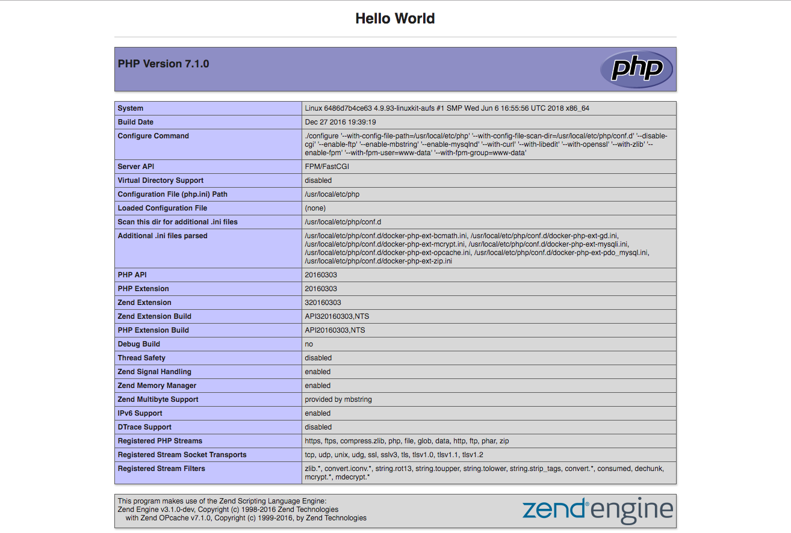
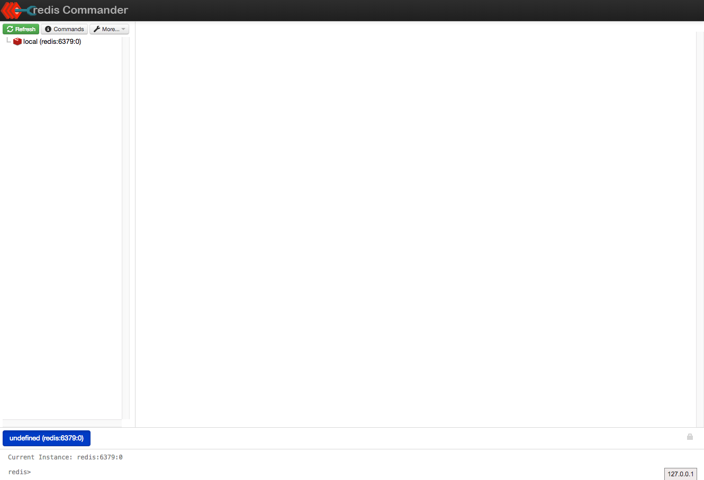
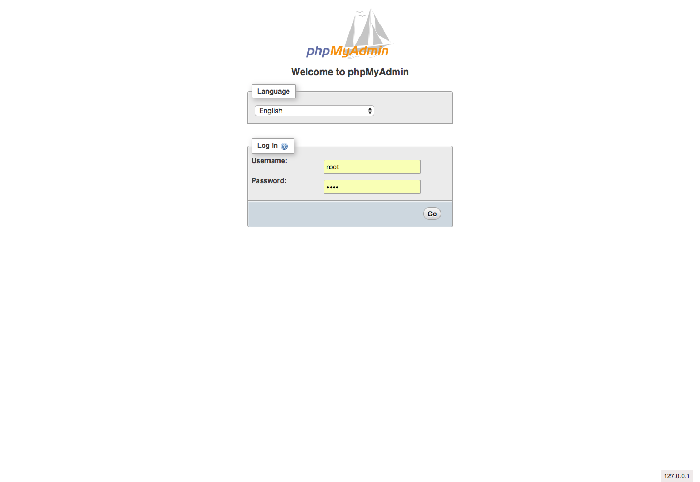
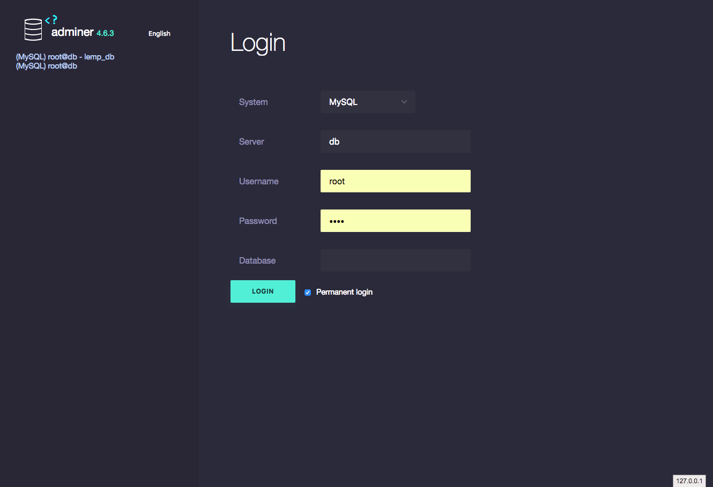

# Lemp-stack With Docker
## IN Docker-compose
* PHP
* NGINX
* MariaDB
* Redis
* Redis-commander
* Adminer
* Backup DB

---
## Getting Start
### Step 1 : Install Docker
Install Docker 
- (MacOS use Docker for mac)
- (Window 10 pro use Docker for window)
- (Window 10 Home use Docker toolbox)
### Step 2 : git clone
```
$ git clone https://github.com/ninediy/lemp-docker.git
```
### Step 3 : run docker-compose
```
$ cd lemp-docker
$ docker-compose up -d
```
---
## Localhost
> http://127.0.0.1

## Redis commander
> http://127.0.0.1:8081

## PMA
> http://127.0.0.1:8000

## Adminer
> http://127.0.0.1:8080

---
## Other
 - stop docker-compose
    ```
    $ docker-compose down
    ```
- restart service docker-compose
    ```
    $ docker-compose restart
    ```
- backup database
    ```
    $ cd lemp-stack
    $ sh mysql/backup.sh
    ```
